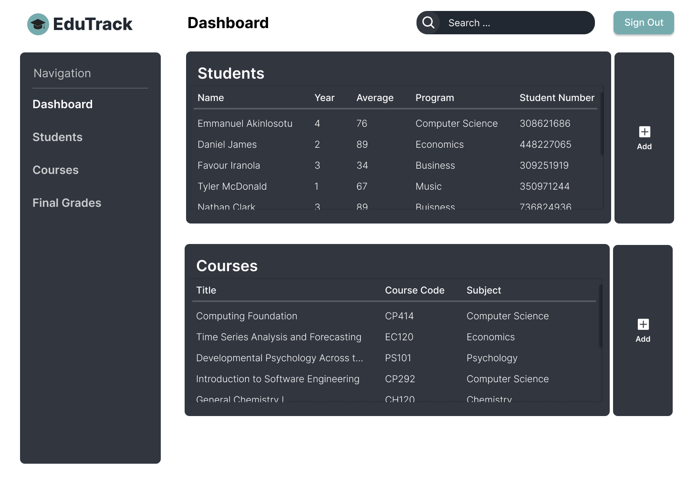

# EduTrack

**Your Comprehensive Course and Student Management System**

---

## Overview

**EduTrack** is a user-friendly web application designed to streamline course and student management for educational institutions. The application enables users to manage student records, track courses, and calculate final grades efficiently. This project was developed as an academic exercise and showcases practical implementation of CRUD functionalities with PHP, MySQL, and a dynamic user interface.

---

## Features

- **Course Management**: Add, update, and delete courses with detailed information, including grades and subjects.
- **Student Management**: Maintain comprehensive student profiles, including personal details, year of study, and enrolled courses.
- **Final Grade Calculation**: Automatically calculate and display final grades based on input scores.
- **Search Functionality**: Quickly find courses or students using the search feature.
- **Interactive User Interface**: A clean and responsive interface for easy navigation and management.

---

## Tech Stack

- **Frontend**: HTML, CSS, JavaScript
- **Backend**: PHP with MySQL
- **Database**: MySQL
- **Design**: Figma for UI/UX prototyping

---

## How It Works

1. **Course Management**: Users can add new courses, edit course details, and delete courses as needed.
2. **Student Records**: Add new students, update their details, and view their profiles.
3. **Grade Calculation**: Input test scores and final exams to calculate student grades.
4. **Dynamic Dashboard**: View an organized summary of all courses and students in one place.

---

## Screenshots

<table>
  <tr>
    <td align="center">
      <strong>Add Course Popup</strong> 
      
    </td>
    <td align="center">
      <strong>Add Student Popup</strong> 
      
    </td>
    <td align="center">
      <strong>Dashboard - Courses</strong> 
      
    </td>
  </tr>
  <tr>
    <td align="center">
      <strong>Dashboard - Final Grades</strong> 
      
    </td>
    <td align="center">
      <strong>Dashboard - Students</strong> 
      
    </td>
    <td align="center">
      <strong>Overall Dashboard</strong> 
      
    </td>
  </tr>
  <tr>
    <td align="center">
      <strong>Individual Course Popup</strong> 
      
    </td>
    <td align="center">
      <strong>Individual Course Popup - 1</strong> 
      
    </td>
    <td align="center">
      <strong>Individual Student Popup</strong> 
      
    </td>
  </tr>
  <tr>
    <td align="center">
      <strong>Individual Student Popup - 1</strong> 
      
    </td>
    <td align="center">
      <strong>Log In</strong> 
      
    </td>
    <td align="center">
      <strong>Sign Up</strong> 
      
    </td>
  </tr>
</table>

---

## Academic Context

This project was developed as part of an academic curriculum to demonstrate practical knowledge of web development, database integration, and dynamic user interfaces. It provides a real-world example of how educational tools can enhance the learning experience.

---

## Key Takeaways

- Designed and implemented CRUD operations for managing students and courses.
- Built a dynamic dashboard for data visualization and management.
- Integrated a MySQL database with a PHP backend for efficient data handling.
- Showcased skills in front-end design and back-end development.

---

**Feel free to reach out for more details about this project!**
